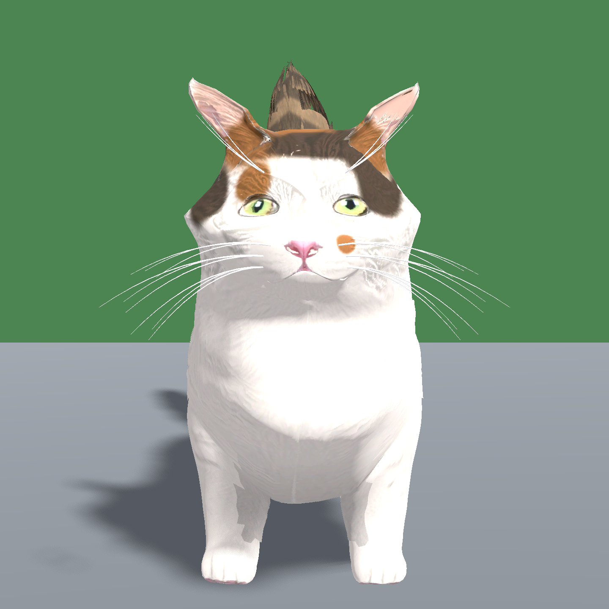
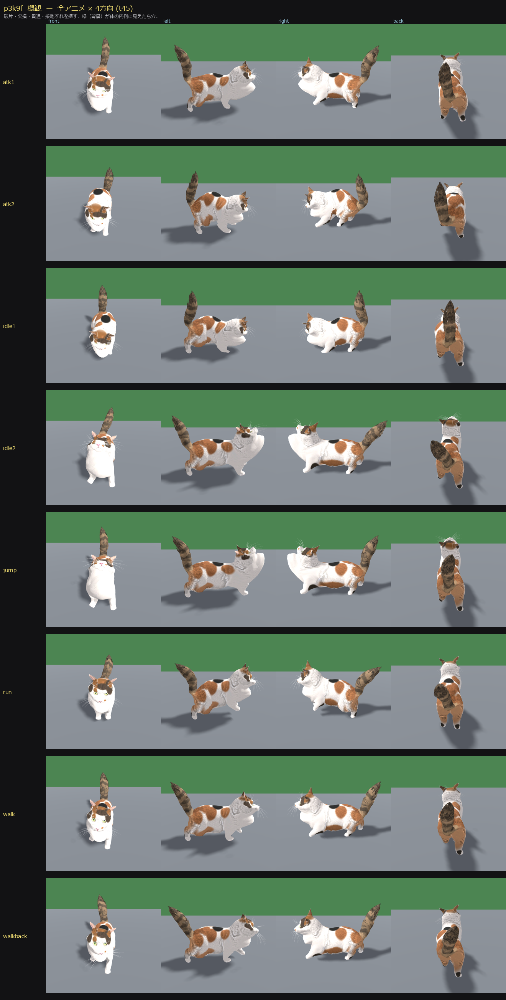

# image2sim-framework

実在の猫（koha）の写真から、ゲームエンジンで動く リグ+アニメーション付き 3D モデルを作るプロジェクト。

現在の成果物は **`output_v2/base/p3_koha9face.glb`**（三毛猫 koha の可動モデル。10アクション内蔵:
Idle×2 / Walk / Walkback / Run / ネコパンチ×2 / Jump / 香箱座り / お座り）と、
**Godot 4.x の操作デモ**（`output_v2/godot/Godot3dcat/`。WASD 移動・ジャンプ・パンチ・座りポーズ）。
このリポジトリには、その生成パイプライン一式と経緯ドキュメントが入っている。

加えて、実測寸法と複数方向の写真を基に、Blender Pythonでドローンを部品単位に
組み立てる**パラメトリックドローン生成機能**を収録している。ローカル3D生成AIは使用しない。

| 顔（正面, 1440px キャプチャ） | 全アニメ × 4方向 |
|---|---|
|  |  |

## 経緯（v1 → v2）

- **v1**（タグ `v1-tripo` まで）: 画像→3D 生成（TripoSR 等のローカル生成、Tripo API 検証）を軸にした
  汎用フレームワーク構想。写真からの直接生成は品質が足りず、方針転換した。
- **v2**（現在, `pipeline_v2/`）: **市販のリグ付き猫ベースモデルを土台に、写真の猫へ「作り替える」**
  アプローチ。再バインド→体型・顔のメッシュ変形→写真実測の三毛柄をテクスチャに焼き込み→髭・毛シェル
  生成→アニメーションのリターゲット、までをすべてスクリプトで決定的に再生成できる。

## v2 パイプラインの構成

すべて `python pipeline_v2/<script>.py` で実行する（Blender 5.0 を `--background` で呼ぶ）。

| 段 | ランナー | 内容 |
|---|---|---|
| P1a〜P2 | `p2_run.py` | ベースモデルの再バインド（Automatic Weights + Data Transfer）→ 頭・体型の整形 → 尻尾カール（Apply as Rest Pose）→ 8アニメのワールド差分リターゲット |
| UVベイク | `p3_uv_bake.py` | UV テクセル→3D位置/支配ボーンのマップ（柄を3D座標で定義するための土台） |
| P3〜P4 | `p3_run_koha9face.py` | 三毛柄の塗り（写真実測パレット）→ 髭生成 → 毛シェル4層 → 尻尾高密度化・細身化・伸長 → 機械ゲート → 1440px キャプチャ |

品質は2本の機械ゲートで回帰検証する:

- `qa_skin_stretch.py` — 全アニメの辺の伸びからスキニング破綻を検出（皮膚 0.5% / 毛シェル 1.0%）
- `qa_belly_bind.py` — 腹のウェイトが脚ボーンに吸われていないか

顔まわりの数値調整の方法は **`FACE_TUNING_GUIDE.md`** にまとめてある。
メッシュ変形時の塗りアンカー追従は `pipeline_v2/p4_remap_anchors.py`（新旧 UV ベイクの同一テクセル対応）。

## パラメトリックドローン生成

### 概要

写真から完成メッシュを直接生成するのではなく、実測寸法をYAMLへ記録し、中央ボディ、アーム、
押出フレーム、主翼、モーター、ESC、プロペラ、プロペラガード、脚部をBlender上で決定的に生成する。

- 既存の4ロータX型・ガード付きdrone2を再生成可能
- 8ロータ・アルミ押出フレーム・主翼付きdrone3を再生成可能
- ローター数、配置、回転方向、各部品の寸法と有無を設定可能
- 4ロータ互換、放射配置、モーター座標の個別指定に対応
- `.blend`、GLB、6方向レンダー、寸法QA、日本語レポートを同じ設定から生成
- 各プロペラは独立ノードを持ち、BlenderやGLB読込先で個別に回転可能

詳しい操作は[パラメトリックドローン生成 詳細利用手順](newplan2/06_パラメトリックドローン生成_詳細利用手順.md)、
設計方針は[テンプレート方式の設計・利用方法](newplan2/05_テンプレート方式設計と利用方法.md)を参照。

### 必要環境

- Windows
- Python 3.x
- Blender 5.2 LTS
- `requirements.txt`のPythonパッケージ

```powershell
pip install -r requirements.txt
```

Blenderを標準パス以外へインストールした場合は、実行時に`--blender`で指定する。

### 既存drone2を生成する

公開リポジトリには実物写真を含めていない。写真比較シートも生成する場合は、次の6枚を
`input/raw_photos/drone2/`へ配置する。

```text
上.jpg
下.jpg
前.jpg
後.jpg
左.jpg
右.jpg
```

実測値と部品寸法は[`config/drone2_model.yaml`](config/drone2_model.yaml)に記録されている。
生成コマンドは次のとおり。

```powershell
python scripts\drone_model\run_build.py --overwrite
```

写真を配置せず、モデル生成だけを行う場合：

```powershell
python scripts\drone_model\run_build.py --overwrite --skip-contact-sheet
```

主な出力先は`output/drone2_parametric/`である。

| 成果物 | 内容 |
|---|---|
| `drone2.blend` | 編集・確認用Blenderファイル |
| `drone2.glb` | ゲームエンジン・シミュレータ連携用モデル |
| `renders/*.png` | 上下前後左右の6方向レンダー |
| `comparison_sheet.png` | 実物写真とレンダーの比較シート |
| `qa_report.json` | 寸法、ローター数、必須部品名の検査結果 |
| `BUILD_REPORT.md` | 日本語の生成結果レポート |
| `resolved_config.json` | テンプレート継承後の最終設定 |

### 大型フレーム機drone3を生成する

drone3は、Excel部品表、寸法注記画像、PDF図面、HEIC写真を基にした8ロータ機である。
部品表の正規化と既知質量下限の集計後、Blenderモデルを生成する。

```powershell
python scripts\drone_model\analyze_drone3_bom.py
python scripts\drone_model\run_build.py --config config\drone3_model.yaml --overwrite
```

設定は[`config/drone3_model.yaml`](config/drone3_model.yaml)、出力は
`output/drone3_parametric/`へ保存される。通常の成果物に加え、`PARTS_SUMMARY.md`と
`parts_inventory.json`へ部品表の整理結果を出力する。

参照用として、`output/drone2_parametric/`の現行drone2、過去形状の`archive`、6方向レンダー、
および`hex6_radial/`の6ロータ成果物はGitへ収録している。ログ、JSONレポート、比較シート、
Blenderの自動バックアップは引き続きGit管理対象外で、ローカルで再生成する。

### 別のドローンを生成する

機体固有のYAMLから、近いテンプレートを継承する。

```yaml
template_file: config/drone_templates/multirotor_base.yaml
subject_id: new_drone

layout:
  mode: radial
  rotor_count: 6
  radius_mm: 55.0

body:
  width_mm: 42.0
  length_mm: 60.0
  height_mm: 18.0
```

利用できる配置方式：

| `layout.mode` | 用途 |
|---|---|
| `square_diagonal` | 対角モーター中心間距離から4ロータX型を作る |
| `radial` | 任意数のローターを中心から同じ半径へ等間隔配置する |
| `explicit` | 各モーターのX・Y座標を個別指定する |

6ロータの設定例を実行する場合：

```powershell
python scripts\drone_model\run_build.py `
  --config config\examples\hex6_radial_model.yaml `
  --overwrite `
  --skip-contact-sheet
```

テンプレートは[`config/drone_templates/`](config/drone_templates/)にある。新しい機体では、
写真からモーター中心位置と外形を確認し、全幅、全長、ボディ寸法、プロペラ径を実測して
機体固有YAMLへ入力する。既存の部品で表現できないダクト、ジンバル、折り畳み機構などは、
`blender/drone_model/build_drone.py`へ専用の部品生成関数を追加する。

### 検証

テンプレート継承と配置計算のテスト：

```powershell
python -m unittest tests.test_drone_model_templates -v
```

Blender生成コードの構文確認：

```powershell
python -m compileall scripts\drone_model blender\drone_model
```

## リポジトリ構成

```text
pipeline_v2/   v2 パイプライン本体（現在の主戦場）
newplan/       v2 の経緯・結果ドキュメント（P0仕様、各段の結果、セッションログ）
newplan2/      パラメトリックドローンの設計・採寸・テンプレート利用方法
blender/       猫モデルおよびドローン部品生成用のBlenderスクリプト群
scripts/       画像処理、検証、ドローン生成ランナー
config/        猫用パレット、ドローン機体設定、ドローンテンプレート
output_v2/     生成物（p3_koha9face の glb/blend/テクスチャのみコミット。他はローカル再生成）
output_v2/godot/Godot3dcat/   Godot 4.6 プロジェクト（猫コントローラ+ビューア。下記）
images/        README 用プレビュー画像
FACE_TUNING_GUIDE.md   顔の数値調整ガイド
```

## Godot で動かす

`output_v2/godot/Godot3dcat/` は Godot 4.6 のプロジェクト。モデル glb はリポジトリ肥大を
避けるため未収録なので、最初に `output_v2/base/` からコピーする（インポート設定
`p3_koha9face.glb.import`（ループ指定入り）はコミット済み）。

```powershell
Copy-Item output_v2\base\p3_koha9face.glb output_v2\godot\Godot3dcat\
godot --path output_v2/godot/Godot3dcat res://scenes/PlayTest.tscn
```

| シーン | 内容 |
|---|---|
| `scenes/PlayTest.tscn` | 操作デモ。WASD=移動 Shift=走る S=後退 Space=ジャンプ J/K=ネコパンチ C=お座り V=香箱 Q/E=カメラ |
| `scenes/ViewFace.tscn` | 全10アクションのビューア（1〜9,0 で切替） |
| `scenes/JumpTest.tscn` | ジャンプの放物線+着地補正の検証（T で補正 ON/OFF 比較） |
| `scripts/cat_controller.gd` | キャラ本体。入力を持たない「意図 API」設計（プレイヤーでも AI でも駆動可能） |

## 含めていないもの（公開リポジトリのため）

- `input/` — 実物の猫の写真 **再配布不可のため除外**
- `output_v2/` の大部分 — パイプラインで決定的に再生成できる中間生成物・バックアップ
- v1 期のゲームエンジン作業フォルダ（godot / unity / unreal）と設計・タスク文書（docs）— ローカル管理
  （現行の Godot プロジェクトは `output_v2/godot/Godot3dcat/` として公開している）
- `png/`、Godot が自動展開したテクスチャ

**アセットの利用について**: コミットされている `p3_koha9face.*`（GLB/blend/テクスチャ）は、プレビュー・学習目的での閲覧を想定しており、**素材としての再配布・再利用はできません**。

## 再生成のしかた（ローカル）

前提: Windows / Blender 5.0 / Python 3.x / `input/` に素材と写真がある環境。

```powershell
python pipeline_v2\p2_run.py                                   # 上流（バインド〜リターゲット）
python pipeline_v2\p3_uv_bake.py --glb output_v2\base\p2_koha.glb
python pipeline_v2\p3_run_koha9face.py                         # 柄・髭・毛・ゲート・キャプチャ
```

結果画像: `output_v2/reports/p1_shots/p3k9f_head_*.png`（顔4方向）、
`output_v2/reports/p1_contact_p3k9f_overview.png`（全アニメ×4方向）。

## v1 のドキュメント

v1 期のタスク仕様・レビュー運用の文書はローカル管理に移した（公開対象外）。
v1 最終時点のコードはタグ `v1-tripo` を参照。
