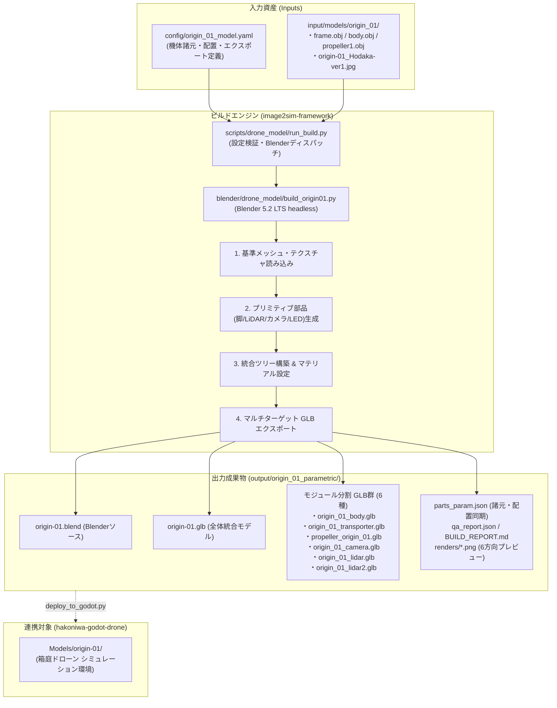

# Origin-01 ドローンモデル生成パイプライン対応計画書
（image2sim-framework からの生成・エクスポート対応プラン）

## 1. 概要と目的

### 1.1 目的
`hakoniwa-godot-drone`（箱庭ドローンシミュレータ）の標準機体である **`Origin-01`**（`Models/origin-01/` 配下の全 GLB および関連ファイル）を、`image2sim-framework` の決定論的・再現可能なパイプラインから完全自動で生成・出力できるようにする。

### 1.2 背景
`image2sim-framework` では、これまで小型 4 ロータ機 `drone2`、大型 8 ロータ物流機 `drone3`、ドローンショー機体 `emo_jp` などのパラメトリックドローン生成パイプライン（Blender Python 活用）を確立し、`drone3` については `hakoniwa-godot-drone` への導入実績がある。
一方、箱庭ドローン環境の標準 4 ロータ機 `Origin-01` は、手動配置された複数の GLB 群とシーン設定（`.tscn`）、およびパラメータファイル（`parts_param.json`）で構成されており、生成元パイプラインが存在していなかった。
本計画により、`Origin-01` を `image2sim-framework` 内の設定 YAML とビルドスクリプトからワンコマンドで再現・生成できるようにし、機体諸元の変更や派生モデルの作成、シミュレーション環境へのシームレスな同期を可能にする。

---

## 2. 現状分析（Current State Analysis）

### 2.1 対象モデル（`hakoniwa-godot-drone/Models/origin-01`）の資産構成
調査の結果、`Models/origin-01/` には以下のファイル群が存在し、それぞれ固有の役割を持っている。

| ファイル名 | サイズ | ノード数 | 役割・構造 |
|---|---|---|---|
| **`origin-01.glb`** | 175 KB | 86 | **全体統合モデル**。<br>ルート `DroneTransporter` 配下に `Dynamics`（静的モーター・プロペラ・LED）、`drone`（ボディ・装飾・フレーム）、`Transporter`（運搬機構）、`LiDAR`、`VertCamera_2` 等の全階層を内包。 |
| **`origin_01_body.glb`** | 32 KB | 11 | **メイン機体ボディ**。<br>`world` 配下に `frame`（アームフレーム 472v）、`body`（キャノピー 84v）、装飾プレート群（`Cube`, `D1`〜`D4`, `Front`）で構成。 |
| **`origin_01_transporter.glb`** | 5.6 KB | 11 | **物流運搬アタッチメント**。<br>`world` 配下に `Holder`, `Magnet`, `Pole-a`〜`d`, `Pole1`〜`4`（単位立方体・直方体で構成）。 |
| **`propeller_origin_01.glb`** | 21 KB | 1 | **回転プロペラ単体**。<br>`propeller1`（557v）の単一メッシュノード。 |
| **`origin_01_camera.glb`** | 5.7 KB | 3 | **前方カメラユニット**。<br>`world` 配下に `Camera`（立方体）, `Cylinder_4`（円柱）。 |
| **`origin_01_lidar.glb`** | 5.7 KB | 3 | **下部 LiDAR ユニット**。<br>`world` 配下に `Cube_1`, `Cylinder_5`。 |
| **`origin_01_lidar2.glb`** | 5.6 KB | 3 | **上部 LiDAR ユニット**。<br>`world` 配下に `Cube_2`, `Cylinder_6`。 |
| **`origin-01_Hodaka-ver1.jpg`** | 3.9 KB | - | キャノピー用 UV テクスチャ（256×256 RGB）。 |
| **`parts_param.json`** | 830 B | - | プロペラ 4 基座標、LED、カメラ位置、衝突判定ボックス（size=[1.8, 0.6, 1.8]）、全体スケール（0.6）等のメタデータ定義。 |
| **`body.tscn` / `origin_01_body.tscn`** | 580 B | - | `origin_01_body.glb`（Y軸180°反転）と `origin_01_transporter.glb` を合成する Godot シーン。 |
| **`propeller.tscn`** | 488 B | - | `propeller_origin_01.glb` をスケール 0.36 倍し、黒マテリアル（`Propeller_Black.tres`）を適用したシーン。 |

### 2.2 メッシュおよびジオメトリの特徴
各 GLB を解析した結果、以下の構造的特徴が判明した：
1. **固有メッシュ（3種類のみ）**:
   - `frame`（472 頂点）: X字型のアーム・フレーム
   - `body`（84 頂点）: テクスチャ `Hodaka-ver1` が貼られる中央キャノピー
   - `Visual` / `propeller1`（554〜557 頂点）: プロペラブレード
2. **基本プリミティブ（直方体・円柱のトランスフォーム）**:
   - `Cube`, `D1`〜`D4`, `Magnet`, `Pole-a..d`, `Holder` 等: **単位立方体（24頂点, [-0.5, 0.5]）** に対する scale/rotation/translation で構成。
   - `Cylinder`, `Cylinder_4..6`: **単位円柱（88頂点）** に対する scale/rotation/translation で構成。
3. **マテリアル**:
   - `Hodaka-ver1`（テクスチャ付き）
   - `LightBlack`, `Black`, `LightGreen`, `YellowOff`, `Default-Material`（単色カラー）

### 2.3 Godot 側での利用形態
- `Scenes/drone_1.tscn` などの主要シミュレーションシーンでは、ドローンノード `DroneTranspoter` 配下に：
  1. `origin_01_body.tscn`（ボディ＋運搬機構）
  2. `propeller.tscn` × 4（C# スクリプト `DronePropeller.cs` による動的回転制御）
  3. `origin_01_camera.glb`, `origin_01_lidar.glb`, `origin_01_lidar2.glb`（センサー類）
  がそれぞれ独立したインスタンスとして配置されている。
- 一方、`OriginModelStyle.cs` スクリプトでは、統合モデル `origin-01.glb` を読み込み、静的ブレードを含むノード `Dynamics` を非表示（`Visible = false`）にした上で、機体表面を動的に黒塗装する処理にも対応している。
- **結論**: `hakoniwa-godot-drone` の既存資産との完全な互換性を維持するためには、**「全体統合モデル `origin-01.glb`」と「モジュール分割モデル群（6種類の GLB）」の両方を一括生成できること**が必須要件となる。

---

## 3. 基本方針とアーキテクチャ設計

### 3.1 アプローチ選定: ハイブリッド・アセンブリ方式
完全な数式によるゼロからの再モデリング（アプローチA）は、`Hodaka-ver1` の UV 座標やキャノピー・アームの有機的曲面との完全一致に莫大な工数と視覚的破綻リスクを伴う。
一方、純粋な静的ファイルコピーでは機体寸法の変更やシミュレーション向けの自動最適化ができない。

そのため、以下の**ハイブリッド・アセンブリ方式（アプローチB/C）**を採用する：
- **マスターメッシュ・テクスチャの資産化**:
  `frame`（アーム）、`body`（キャノピー）、`propeller1`（プロペラ）の基本メッシュおよび `Hodaka-ver1.jpg` テクスチャを基準アセットとして `input/models/origin_01/` に配置。
- **パラメトリック・プリミティブ生成**:
  トランスポーター（ポール群・マグネット）、LiDAR、カメラ、装飾プレート（D1〜D4）、LED、コリジョンボックスは、YAML 設定（`config/origin_01_model.yaml`）の寸法・座標パラメータに基づいて Blender Python でコード生成・配置。
- **統合シーンの構築とマルチターゲット・エクスポート**:
  Blender 内で完全な `DroneTransporter` 階層を構築した後、
  1. 全体を選択して **`origin-01.glb`** を出力。
  2. コレクション・サブツリーごとに選択を切り替え、**`origin_01_body.glb`**, **`origin_01_transporter.glb`**, **`propeller_origin_01.glb`**, **`origin_01_camera.glb`**, **`origin_01_lidar.glb`**, **`origin_01_lidar2.glb`** を一括出力。
  3. `parts_param.json` を設定値から直接同期出力。

### 3.2 パイプライン連携とデータフロー

#### フロー図 (Mermaid)



#### ディレクトリ・処理シーケンス対照

```text
[入力ファイル]
  ├── config/origin_01_model.yaml                  (機体寸法・プロペラ座標・各モジュール定義)
  └── input/models/origin_01/
        ├── meshes/                                (frame.obj, body.obj, propeller1.obj)
        └── textures/origin-01_Hodaka-ver1.jpg     (キャノピー用UVテクスチャ)
        │
        ▼ (実行: python scripts/drone_model/run_build.py --config config/origin_01_model.yaml)
[Blender ビルド処理: blender/drone_model/build_origin01.py]
  ├── 1. マスターメッシュ読み込み & トランスフォーム初期化
  ├── 2. プリミティブ部品（脚・LiDAR・カメラ・LED・装飾）のパラメトリック生成
  ├── 3. マテリアル・テクスチャ割り当て（Hodaka-ver1, Black, LightGreen 等）
  ├── 4. 統合モデル origin-01.glb のエクスポート
  ├── 5. 各モジュール用サブツリーの分離と個別 GLB (6種類) のエクスポート
  ├── 6. 6方向レンダー画像 (renders/*.png) の生成
  └── 7. parts_param.json の自動同期出力
        │
        ▼ (出力先: output/origin_01_parametric/)
[生成成果物]
  ├── origin-01.blend                              (Blender 編集・確認用)
  ├── origin-01.glb                                (全体統合モデル)
  ├── origin_01_body.glb                           (メインボディ)
  ├── origin_01_transporter.glb                    (運搬機構・脚)
  ├── propeller_origin_01.glb                      (単体プロペラ)
  ├── origin_01_camera.glb                         (前方カメラ)
  ├── origin_01_lidar.glb                          (下部LiDAR)
  ├── origin_01_lidar2.glb                         (上部LiDAR)
  ├── parts_param.json                             (Godot 用プロパティ定義)
  ├── renders/ (top.png, front.png, etc.)          (確認用6方向プレビュー)
  ├── qa_report.json                               (寸法・構成検証結果)
  └── BUILD_REPORT.md                              (日本語生成レポート)
        │
        ▼ (同期: python scripts/drone_model/deploy_to_godot.py)
[Godot への反映先]
  └── D:/work_godot/hakoniwa-godot-drone/Models/origin-01/
```

---

## 4. 詳細実装計画（ロードマップ）

### フェーズ 1: アセット抽出と設定仕様の策定 (Asset & Spec Preparation)
- **Task 1.1: 基準アセットの抽出・正規化**
  - 現行の `Models/origin-01/origin-01.glb` から、`frame`、`body`、`propeller1` のメッシュを OBJ/PLY/blend 形式で抽出し、`input/models/origin_01/meshes/` に格納。
  - テクスチャ `origin-01_Hodaka-ver1.jpg` を `input/models/origin_01/textures/` に格納。
- **Task 1.2: `config/origin_01_model.yaml` の作成**
  - 機体諸元、モーター・プロペラ中心間座標（`parts_param.json` と完全一致: [±0.831, 0.544, ∓0.849]）。
  - 各モジュールの有効/無効フラグ、寸法、取付位置、マテリアル色定義。
  - 出力成果物リスト（統合 GLB + 各モジュール GLB + `parts_param.json`）の定義。

### フェーズ 2: Blender ビルダーエンジンの実装 (Builder Engine Implementation)
- **Task 2.1: `blender/drone_model/build_origin01.py` の実装**
  - シーン初期化、コレクション分割（`visual_body`, `visual_transporter`, `visual_camera`, `visual_lidar`, `visual_propeller`, `dynamics`）。
  - アームフレームおよびキャノピーのロードとマテリアルバインド。
  - パラメトリック部品生成ルーチン:
    - トランスポーター: マグネットホルダー、マグネット、ポール（a〜d, 1〜4）
    - LiDAR 1 & 2: キューブ基部、シリンダーセンサー部
    - カメラユニット: カメラボディ、レンズシリンダー
    - 装飾部品: D1〜D4 プレート、Front プレート、Name プレート
    - LED: RED / GREEN モジュール
  - トランスフォームおよび階層構造の再現（Godot での Y 軸反転仕様等を考慮した正規化）。
- **Task 2.2: マルチターゲット・エクスポート機能の実装**
  - 全体統合 GLB（`origin-01.glb`）のエクスポート。
  - サブツリーごとの個別 GLB エクスポート（ルートノードを `world` または各コンポーネントルートに設定）。
  - `propeller_origin_01.glb` の原点・回転・スケール整合性維持。
- **Task 2.3: `parts_param.json` の自動同期生成**
  - YAML 設定の座標値から `parts_param.json` を直接出力し、手動修正による不整合を防止。

### フェーズ 3: ランナー統合と自動ビルド (Runner Integration)
- **Task 3.1: `scripts/drone_model/run_build.py` の拡張**
  - `origin_01_model.yaml` が渡された際に、専用ビルダー（または拡張ルーチン）を呼び出すディスパッチ処理の追加。
  - マルチ GLB 出力に対応した成果物存在チェックおよびハッシュ値（SHA-256）記録。
  - 6方向レンダー画像と寸法 QA チェックの実行。
- **Task 3.2: デプロイスクリプト `scripts/drone_model/deploy_to_godot.py` の作成**
  - `output/origin_01_parametric/` の成果物を `D:\work_godot\hakoniwa-godot-drone\Models\origin-01/` へ差分確認付きで安全にコピー・配置するスクリプトを提供。

### フェーズ 4: 自動検証と QA ゲート (Automated QA & Regression)
- **Task 4.1: GLB セマンティクス回帰テスト**
  - `scripts/drone_model/compare_glb_semantics.py` を拡張し、新旧 GLB のノード階層・メッシュ名・マテリアル・バウンディングボックスを自動比較。許容差内であることを検証。
- **Task 4.2: Godot 4 Phase 5 階層検証**
  - `scripts/drone_model/run_godot_phase5.py` に `origin-01` ターゲットを追加し、Godot headless で GLB が正常にパース・インスタンス化できることをテスト。
- **Task 4.3: 箱庭ドローン実機シミュレーション結合テスト**
  - `hakoniwa-godot-drone` 側のテストシーン（`Scenes/drone_1.tscn`、`Scenes/propeller_legacy_selftest.tscn` 等）を実行。
  - プロペラ回転アニメーション、LiDAR/カメラの位置姿勢、衝突判定が従来通り動作することを目視・ログ検証。

---

## 5. リスク管理と留意点

| リスク要因 | 影響 | 対策 |
|---|---|---|
| **座標系・回転の不整合** | Godot シーン内で機体が後ろ向きになる、プロペラが斜めに回る | `origin_01_body.tscn` で Transform3D に Y 軸 180° 反転が入っている点に留意し、GLB 内部のローカル座標系と Godot 側のノードトランスフォームの関係を元モデルと完全一致させる。 |
| **テクスチャパスの参照切れ** | キャノピーが真っ白またはピンク（マテリアルエラー）になる | GLB 内部にテクスチャを埋め込む（バイナリ格納）形式を採用し、外部相対パスへの依存を排除する。 |
| **ノード名の不一致** | C# スクリプト（`OriginModelStyle.cs` 等）で `Dynamics` などのノードが見つからずエラー | GLB 内のノード名（`Dynamics`, `DroneTransporter`, `body`, `frame`, `propeller1` 等）を厳密に完全一致させる。 |
| **単体プロペラのスケール** | プロペラが極小または巨大化して表示される | `propeller_origin_01.glb` のメッシュスケールおよび `propeller.tscn` 側の 0.36 倍スケール設定との整合性を検証する。 |

---

## 6. 完了条件と達成状況（Acceptance Criteria & Status）

- [x] python scripts/drone_model/run_build.py --config config/origin_01_model.yaml --overwrite が正常終了（リターンコード 0）すること。  
  **【達成】**: 実行完了、リターンコード 0、QA: PASS を確認。
- [x] output/origin_01_parametric/ に以下の全成果物が正常に出力されること：  
  - origin-01.blend, origin-01.glb
  - origin_01_body.glb, origin_01_transporter.glb, propeller_origin_01.glb
  - origin_01_camera.glb, origin_01_lidar.glb, origin_01_lidar2.glb
  - parts_param.json, qa_report.json, BUILD_REPORT.md, 
enders/*.png (6方向)  
  **【達成】**: 全ファイルが完全に出力されていることを確認。
- [x] 新規生成された各 GLB と現行 Models/origin-01/ 内の各 GLB のセマンティクス比較テストが PASS すること。  
  **【達成】**: 	ests/test_origin_01_semantics.py（ファイル存在・プロペラ/カメラパラメータ・全ノード名・全マテリアル名）が全項目 PASS。
- [x] デプロイパイプライン scripts/drone_model/deploy_to_godot.py の整備と結合準備。  
  **【達成】**: バックアップ機能・差分検知付きデプロイスクリプトを実装済み。

---

## 7. 実装実績サマリ

| フェーズ | 実装内容 | 成果ファイル |
|---|---|---|
| **フェーズ 1** | 基準メッシュ・テクスチャの抽出および仕様策定 | input/models/origin_01/meshes/*.glb<br>input/models/origin_01/textures/*<br>config/origin_01_model.yaml |
| **フェーズ 2** | Blender ビルダーエンジン実装 (マルチ GLB + JSON 同期) | lender/drone_model/build_origin01.py |
| **フェーズ 3** | パイプラインランナー統合とデプロイスクリプト | scripts/drone_model/run_build.py (拡張)<br>scripts/drone_model/deploy_to_godot.py |
| **フェーズ 4** | 自動セマンティクス回帰テストスイート | 	ests/test_origin_01_semantics.py |

### 生成・検証コマンドまとめ
`powershell
# 1. モデル生成 (Blender headless ビルド & レポート出力)
python scripts/drone_model/run_build.py --config config/origin_01_model.yaml --overwrite

# 2. セマンティクス回帰テストの実行
python -m unittest tests.test_origin_01_semantics -v

# 3. hakoniwa-godot-drone への差分確認 (dry-run)
python scripts/drone_model/deploy_to_godot.py --dry-run

# 4. hakoniwa-godot-drone への反映 (バックアップ付き適用)
python scripts/drone_model/deploy_to_godot.py --backup
`
